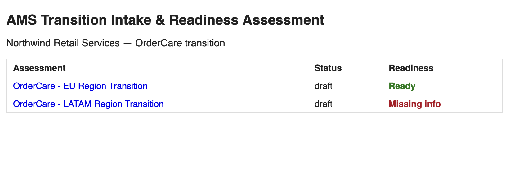
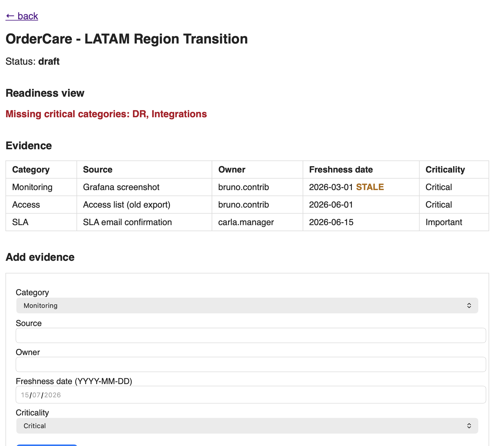
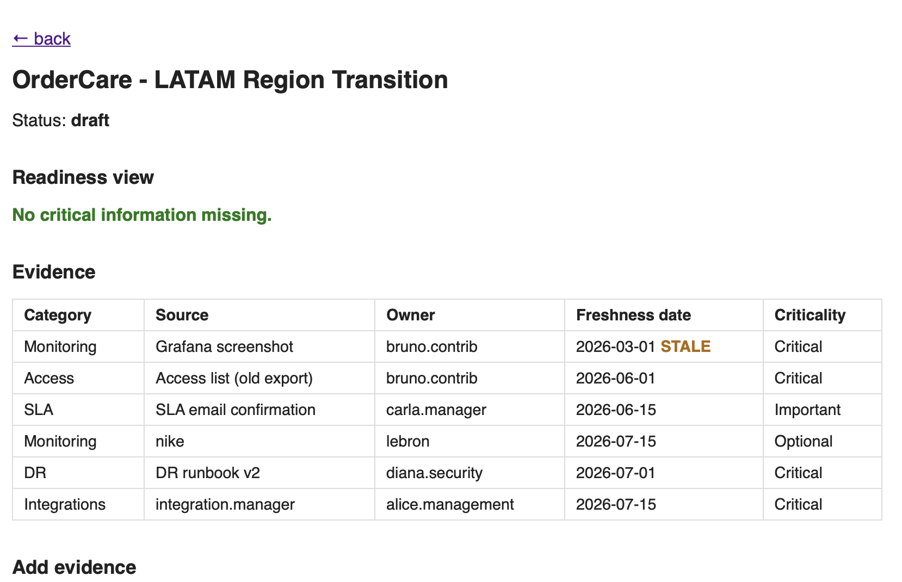
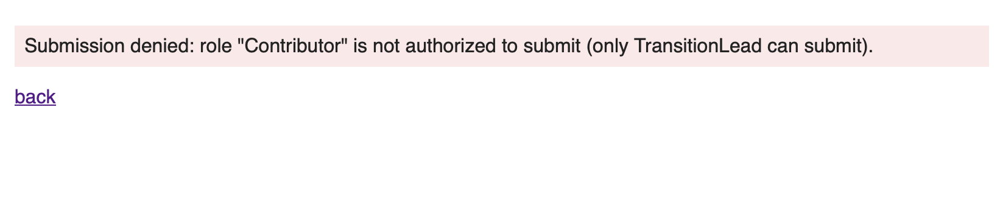
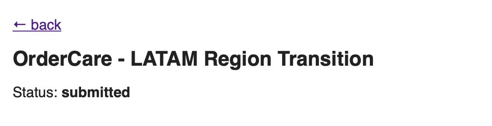
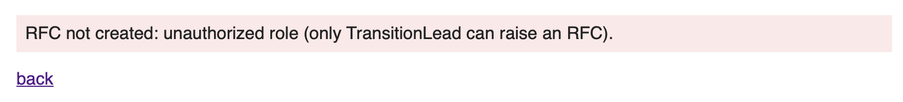
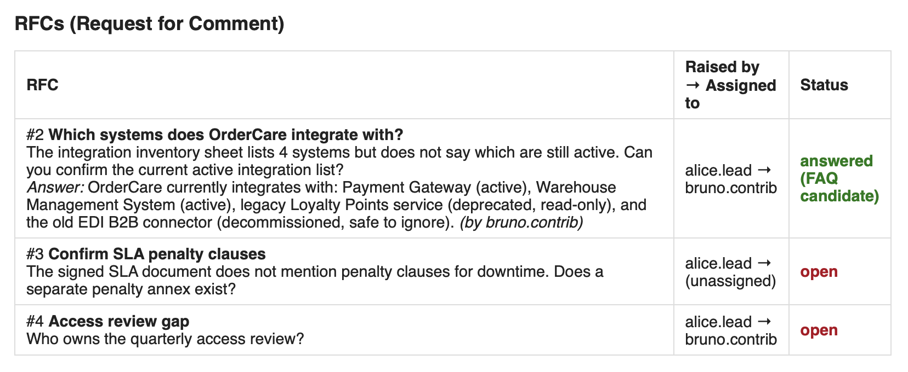

# Screenshots / Notes — Vibe Coding App

## Note 1 — Home page / summary view

Expected: two seeded assessments listed — "OrderCare - EU Region Transition" (Ready) and "OrderCare - LATAM Region Transition" (Missing info).

## Note 2 — Assessment detail with missing critical information

Expected: "Missing critical categories: DR, Integrations" shown in red; evidence table shows the Monitoring row flagged STALE.

## Note 3 — Adding evidence

Expected: page re-renders, "DR" no longer appears in the missing-categories list (only "Integrations" remains).

## Note 4 — Role-gated submission
- Entering `bruno.contrib` (Contributor) → expect rejection message "role ... is not authorized".
- Entering `alice.lead` (TransitionLead) → expect successful submission, status becomes "submitted".

## Note 5 — RFC tool (added by change request): raise + answer flow, verified via CLI

This confirms all four RFC business rules end-to-end through the real running app (not just pytest): unauthorized raise rejected, authorized raise accepted, unauthorized answer rejected, authorized answer accepted and persisted.

